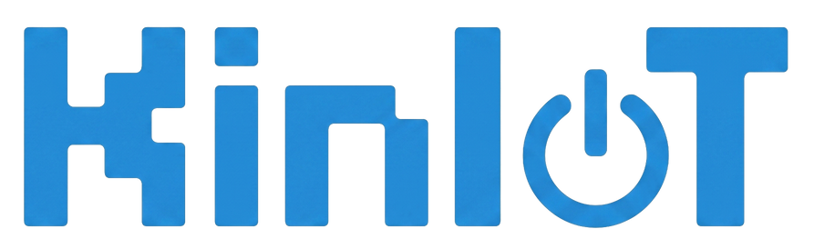

<h1 align="center">👋 Welcome to KinIoT</h1>

Creators of <b>uFlex</b> — IoT-powered rehabilitation system

  

  
  
  

---

## 💡 About KinIoT
We are **KinIoT**, a software startup founded by Software Engineering students at **UPC**.  
Our mission is to transform physical rehabilitation in **Latin America's home-care sector** by bringing clinical precision to the patient's doorstep.

## 🚀 Our Product: uFlex
**uFlex** is an innovative IoT solution designed to modernize joint recovery. By integrating specialized hardware with real-time data tracking, we ensure effective, monitored, and data-driven remote therapy.

### 🎯 Mission
To empower patients and rehabilitation specialists through innovative IoT solutions that guarantee clinical precision at home, reducing recovery times and eliminating uncertainty in remote therapies.

### 🌎 Vision
To be recognized by 2030 as the leading biomechanical telemonitoring startup in Latin America, distinguished by the integration of low-cost hardware and high-fidelity software for joint health.

---

## 📂 Project Ecosystem
Our solution is modular. Below are the core components of the **uFlex** ecosystem:

| Repository                                                                 | Description                                                         |
|:---------------------------------------------------------------------------|:--------------------------------------------------------------------|
| [**uflex-project-report**](https://github.com/KinIoT/uflex-project-report) | Comprehensive project documentation and final technical reports.    |
| [**uflex-landing-page**](https://github.com/KinIoT/uflex-landing-page)     | Official landing page for user acquisition and marketing.           |
| [**uflex-clinic-web**](https://github.com/KinIoT/uflex-clinic-web)         | Web platform for clinics and rehabilitation professionals.          |
| [**uflex-patient-mobile**](https://github.com/KinIoT/uflex-patient-mobile) | Mobile application for patient monitoring and therapy guidance.     |
| [**uflex-rest-api**](https://github.com/KinIoT/uflex-rest-api)             | Main REST API handling core business logic and database management. |
| [**uflex-edge-api**](https://github.com/KinIoT/uflex-edge-api)             | Edge computing API for optimized data pre-processing.               |
| [**uflex-embedded-app**](https://github.com/KinIoT/uflex-embedded-app)     | Embedded software for IoT devices and biomechanical sensors.        |

> [!TIP]
> You can track our full development progress in the [**Repositories**](https://github.com/orgs/KinIoT/repositories) tab.

---

### 📫 Get in touch
* **Organization:** [KinIoT GitHub](https://github.com/KinIoT)
* **Location:** Lima, Perú 🇵🇪
