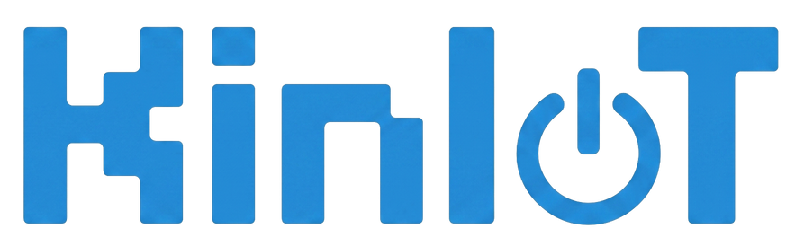
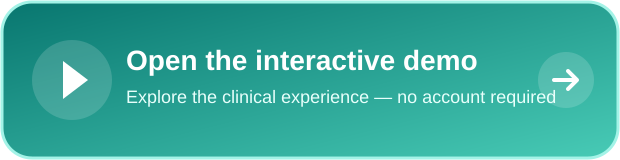
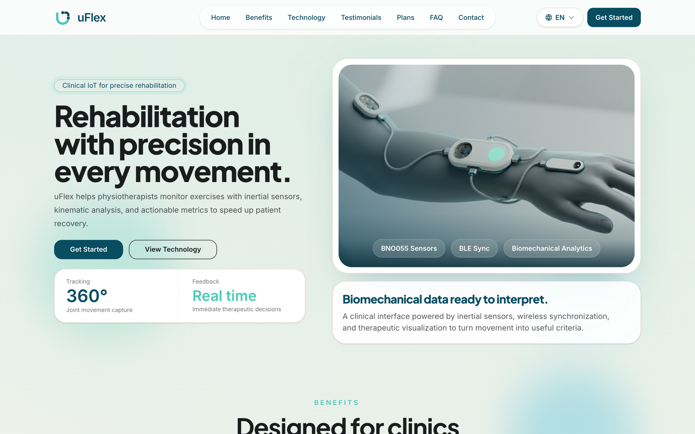
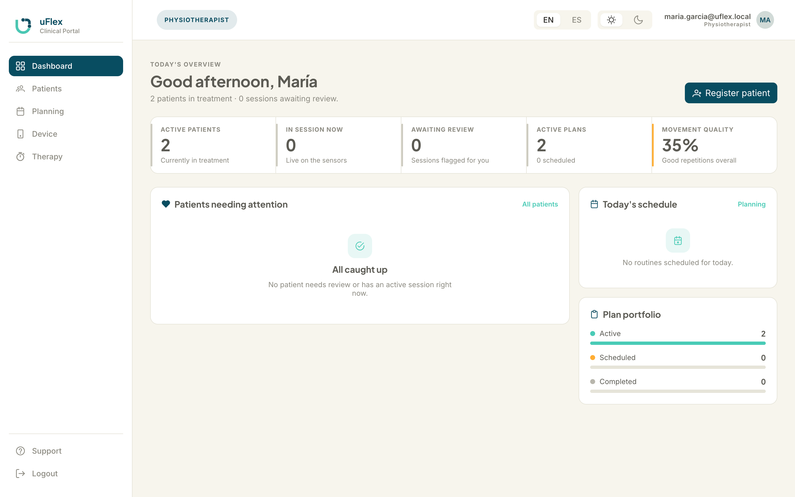
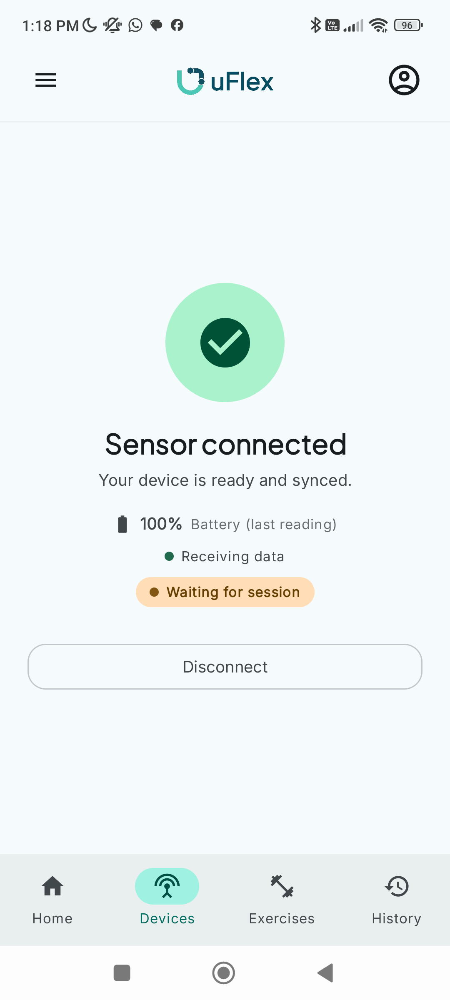
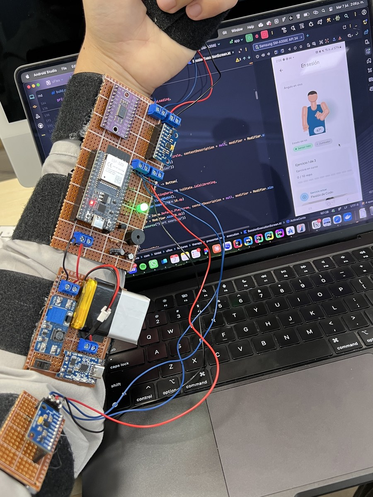

  

KinIoT presents

  

<h1 align="center">Connected rehabilitation, from movement to clinical insight</h1>

  KinIoT builds <b>uFlex</b>, an IoT telerehabilitation ecosystem that connects wearable motion sensors, edge computing, clinical workflows, and guided patient therapy.

<table>
  <tr>
    <td width="50%"></td>
    <td width="50%"></td>
  </tr>
</table>

  

## About KinIoT

We are a software and IoT team founded by Software Engineering students at **UPC** in Lima, Peru. We created uFlex to bring measurable, supervised rehabilitation into the home while keeping physiotherapists connected to each patient's progress.

## One connected rehabilitation ecosystem

uFlex follows movement across the complete care loop:

**ESP32 wearable → Edge Gateway → REST API → Clinic & Developer Web + Patient Mobile**

- The wearable kit measures joint motion through multiple inertial sensors and provides immediate safety feedback.
- The Edge Gateway turns high-frequency sensor readings into reliable local and cloud-ready therapy data.
- The REST API coordinates identity, clinics, treatment plans, devices, sessions, and platform operations.
- Clinic teams plan therapy and review measurable outcomes, while patients follow guided exercises from the mobile app.

## uFlex in action

### Clinical planning and progress

Physiotherapists can coordinate active treatment plans, monitor adherence, and inspect rehabilitation progress from a role-focused clinical workspace.

### Guided therapy with connected hardware

<table>
  <tr>
    <td width="38%" align="center"></td>
    <td width="62%" align="center"></td>
  </tr>
  <tr>
    <td align="center">Patient app pairing and sensor readiness</td>
    <td align="center">ESP32-based wearable prototype with three inertial sensing points</td>
  </tr>
</table>

## Project ecosystem

| Repository | Role in uFlex | Tech stack |
|:--|:--|:--|
| [**uflex-landing-page**](https://github.com/KinIoT/uflex-landing-page) | Product story, benefits, technology, and plans. |   |
| [**uflex-clinic-web**](https://github.com/KinIoT/uflex-clinic-web) | Clinical workspace for administrators and physiotherapists. |   |
| [**uflex-patient-mobile**](https://github.com/KinIoT/uflex-patient-mobile) | Guided Android rehabilitation and live kit feedback. |   |
| [**uflex-developer-web**](https://github.com/KinIoT/uflex-developer-web) | Internal fleet, inventory, fulfillment, and gateway operations. |   |
| [**uflex-rest-api**](https://github.com/KinIoT/uflex-rest-api) | Core business capabilities and ecosystem integration. |   |
| [**uflex-edge-gateway**](https://github.com/KinIoT/uflex-edge-gateway) | Local therapy context, movement processing, and reliable synchronization. |   |
| [**uflex-embedded-app**](https://github.com/KinIoT/uflex-embedded-app) | Wearable sensing, motion calculation, and local safety feedback. |   |
| [**uflex-final-report**](https://github.com/KinIoT/uflex-final-report) | Academic and architectural documentation for the complete project. |  |

> [!TIP]
> Start with the [live landing page](https://uflex-landing-page.vercel.app/) or enter the [Clinic Web demo](https://uflex-clinic-web.vercel.app/sign-in?demo=1) without creating an account.

## Get in touch

- **Organization:** [KinIoT on GitHub](https://github.com/KinIoT)
- **Location:** Lima, Peru 🇵🇪
